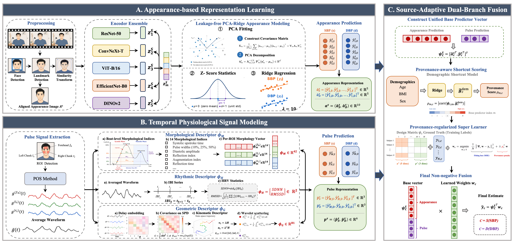

<h1 align="center">
  SourceBP: Source-Adaptive Dual-Branch Representation Fusion for Video-Based Blood Pressure Estimation
</h1>

<p align="center">
  <strong>Xinxin Zhang<sup>1</sup></strong>
  &nbsp;·&nbsp;
  <strong>Gan Pei<sup>1</sup></strong>
  &nbsp;·&nbsp;
  <strong>Feng Zheng<sup>1</sup></strong>
  &nbsp;·&nbsp;
  <strong>Guangtao Zhai<sup>2</sup></strong>
  &nbsp;·&nbsp;
  <strong>Menghan Hu<sup>1,*</sup></strong>
</p>

<p align="center">
  <strong><sup>1</sup>East China Normal University</strong> &nbsp;&nbsp;&nbsp;
  <strong><sup>2</sup>Shanghai Jiao Tong University</strong>
</p>

<p align="center"><sup>*</sup>Corresponding author</p>

<p align="center">
  <a href="https://opensource.org/licenses/Apache-2.0"></a>
  <a href="https://pytorch.org/get-started/locally/"></a>
  <a href="#"></a>
</p>

<p align="center">
  If you have any questions, please contact
  <strong>Xinxin Zhang</strong> (Zhangxinxin5058@163.com) or
  <strong>Menghan Hu</strong> (mhhu@ce.ecnu.edu.cn).
</p>

---

## ✨ A Gentle Introduction

Video-based blood pressure (BP) estimation provides a promising non-contact approach for continuous cardiovascular monitoring, but remains difficult because BP is a latent hemodynamic variable without an explicit visual periodic signature. Existing video-based methods mainly exploit recovered rPPG waveforms or handcrafted pulse descriptors, while the complementary appearance-related vascular cues and dynamic pulse-related physiological cues are often insufficiently modeled and fused. To address these challenges, we propose SourceBP, a source-adaptive dual-branch representation fusion framework for video-based BP estimation. SourceBP consists of an appearance-based representation learning module, a temporal physiological signal modeling module, and a source-adaptive dual-branch fusion module. 
The appearance module captures stable subject-level facial cues as a static prior related to demographic and vascular factors, while the physiological module extracts complementary morphological, rhythmic, and geometric descriptors from facial rPPG signals to characterize short-term cardiovascular hemodynamics. 
The fusion module adaptively weights the two branches according to their reliability, suppresses demographic shortcuts, and learns target-specific non-negative fusion weights for systolic BP (SBP) and diastolic BP (DBP) estimation. Experiments on two public datasets, MCD-rPPG and Face-Hand, demonstrate that SourceBP outperforms recent state-of-the-art methods, achieving MAEs of 10.26/6.86 mmHg for SBP/DBP on MCD-rPPG and 13.96/10.49 mmHg on Face-Hand, respectively.

<p align="center">
  
  <br><em>Overview of the proposed SourceBP dual-branch framework.</em>
</p>

---

## 🧠 Method

**(A) Appearance-based Representation Learning.**
A representative aligned facial frame is encoded by a **heterogeneous ensemble of five frozen pretrained encoders** — ResNet-50, ConvNeXt-T, ViT-B/16, EfficientNet-B0, and the self-supervised DINOv2 — combining convolutional, transformer-based, and self-supervised visual priors. Each backbone embedding is projected via **leakage-free PCA** and mapped to a per-encoder BP prediction by a closed-form **ridge** head, producing an appearance prediction vector $\mathbf{a}^{s}\in\mathbb{R}^{10}$.

**(B) Temporal Physiological Signal Modeling.**
rPPG signals are extracted from multiple facial ROIs (forehead, left/right cheek) via the **POS** method, from which **morphological** ($\phi_M$), **rhythmic** ($\phi_H$: SDNN, RMSSD), and **geometric** ($\phi_G$) descriptors are constructed to yield a pulse prediction vector $\mathbf{p}^{s}\in\mathbb{R}^{6}$.

**(C) Source-Adaptive Dual-Branch Fusion.**
Appearance and pulse predictions are stacked into a unified base-predictor vector. A **provenance-aware** scoring stage discourages reliance on demographic shortcuts (age, BMI, sex), and a **provenance-regularized super learner** estimates **non-negative** fusion weights per target, giving robust final SBP / DBP without explicit source labels at inference.

---

## 📦 Datasets

We evaluate SourceBP on two public video-based BP benchmarks.

**MCD-rPPG** — *Multi-Camera Dataset for Remote Photoplethysmography*, introduced in *"Gaze into the Heart: A Multi-View Video Dataset for rPPG and Health Biomarkers Estimation"* (ACM MM 2025). It contains **3,600 synchronized recordings from 600 subjects**, captured in **resting and post-exercise** states from **three camera views** (frontal webcam, FullHD camcorder, and mobile phone). Each recording is paired with a **100 Hz PPG** signal, ECG, and **13 health biomarkers**, including systolic/diastolic blood pressure, age, sex, and BMI.

**Face-Hand** — introduced in *"Video-based estimation of blood pressure"* (PLOS ONE, 2025). It comprises **400 subjects (200 from India and 200 from Sierra Leone)**, with videos in which **both the face and the hand are clearly visible**, enabling pulse-transit-time–based estimation between facial and palm ROIs. It provides paired cuff blood pressure labels and demographic attributes.

| Dataset | Subjects / Videos | Modality | Ground-truth labels | Links |
|---|:--:|---|---|---|
| **MCD-rPPG** | 600 / 3,600 | Multi-view facial video (3 cameras) | SBP, DBP, PPG@100Hz, ECG, +13 biomarkers | [Paper](https://arxiv.org/abs/2508.17924) · [Dataset](https://huggingface.co/datasets/kyegorov/mcd_rppg) · [Code](https://github.com/ksyegorov/mcd_rppg) |
| **Face-Hand** | 400 | Face + hand (palm) video | SBP, DBP (cuff), demographics | [Paper](https://doi.org/10.1371/journal.pone.0311654) · [Dataset & Code](https://github.com/AiPEX-Lab/vbpe) |

> Please obtain the datasets from their official sources and follow their respective licenses/terms, and **cite the original dataset papers** when using them.
> After downloading, organize the data as expected by the preprocessing scripts (see below) and update the paths in the config.

```
data/
├── MCD-rPPG/
│   ├── videos/
│   └── labels/
└── Face-Hand/
    ├── videos/
    └── labels/
```

---

## ⚙️ Installation

```bash
# 1. Clone
git clone https://github.com/zxx5058/SourceBP.git
cd SourceBP

# 2. Create environment
conda create -n sourcebp python=3.10 -y
conda activate sourcebp

# 3. Install dependencies
pip install -r requirements.txt
```

Core dependencies: `torch`, `torchvision`, `timm`, `numpy`, `scipy`, `scikit-learn`, `opencv-python`, `mediapipe` (face/landmark detection).

---

## 🚀 Usage

```bash
# 1) Preprocess: face alignment, ROI extraction, rPPG (POS)
python preprocess.py --dataset MCD-rPPG --data_root ./data/MCD-rPPG

# 2) Extract appearance embeddings from the frozen encoder ensemble
python extract_appearance.py --dataset MCD-rPPG

# 3) Build pulse descriptors (morphological / rhythmic / geometric)
python extract_pulse.py --dataset MCD-rPPG

# 4) Train the source-adaptive fusion and evaluate
python run_sourcebp.py --dataset MCD-rPPG --config configs/mcd_rppg.yaml
```

> Replace script/flag names to match your actual repo layout.

---

## 📊 Results

State-of-the-art performance on both public benchmarks (video-only, subject-independent evaluation):

| Dataset | SBP MAE (mmHg) | DBP MAE (mmHg) |
|:--|:--:|:--:|
| **MCD-rPPG** | **10.26** | **6.86** |
| **Face-Hand** | **13.96** | **10.49** |

<p align="center">
  
  <br><em>Comparison with recent state-of-the-art methods across hypertension subgroups.</em>
</p>

---

## 📌 Citation

If you find this work useful, please consider citing:

```bibtex
@article{zhang2026sourcebp,
  title   = {SourceBP: Source-Adaptive Dual-Branch Representation Fusion for Video-Based Blood Pressure Estimation},
  author  = {Zhang, Xinxin and Pei, Gan and Zheng, Feng and Zhai, Guangtao and Hu, Menghan},
  journal = {arXiv preprint arXiv:XXXX.XXXXX},
  year    = {2026}
}
```

---

## 🙏 Acknowledgements

This work is sponsored by the National Natural Science Foundation of China (No. 62371189). We thank the authors of the MCD-rPPG and Face-Hand datasets for making their data publicly available.

---

## 📄 License

This project is released under the [Apache 2.0 License](https://opensource.org/licenses/Apache-2.0).
